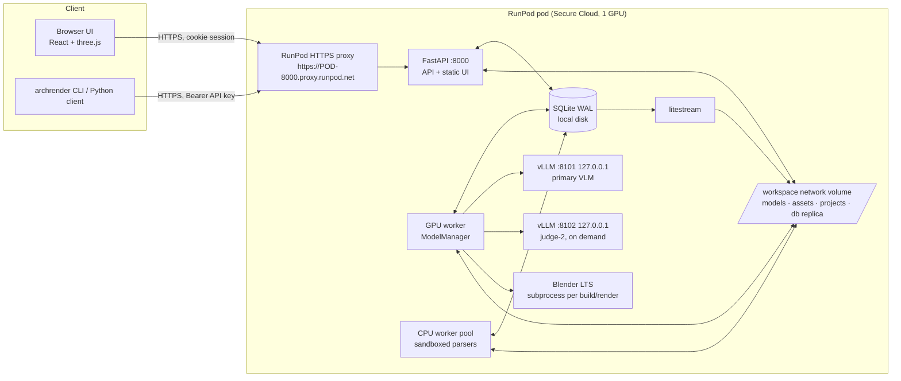

# ArchRender: Architecture

Status: **Phase 0 draft, awaiting approval** · Date: 2026-09-30 · Owner: lead engineer
Companion docs: [MODEL_SELECTION.md](MODEL_SELECTION.md) (which model fills each role, with license
evidence) · [DECISIONS.md](DECISIONS.md) (system ADRs) · [RISKS.md](RISKS.md) · [PLAN.md](PLAN.md)

ArchRender turns a project's mixed documents into a verified 3D scene and then into photoreal,
dimensionally faithful renders of a selected section. The design rests on one rule: **geometry is
measured, never hallucinated.** Everything that has to be correct (walls, openings, dimensions,
furniture placement, materials) lives in a deterministic 3D scene built from a verified plan.
Generative models only add photographic realism, under structural conditioning, and a QA loop
checks their output against the scene's ground truth. When automation cannot guarantee a result,
the system sends it to a human gate.

---

## 1. Principles → mechanisms

| # | Principle | Mechanism | Enforced in | Proven by |
|---|---|---|---|---|
| 1 | Geometry measured, never hallucinated | PlanGraph built only by deterministic extractors (IFC/DXF/PDF/raster CV). VLMs *verify* and *label*, never emit coordinates (the VLM output schemas contain no coordinate fields). Diffusion runs only in S8, under masks, and is checked in S9. | `plan/`, `refine/`, `qa/` | Property tests; the S9 geometry-drift metrics; fault injection |
| 2 | Provenance + confidence on every fact; conflicts surfaced | Every extracted value is a `Fact[T]` carrying `Provenance`. A `ConflictDetector` runs after each extractor, and precedence rules produce a *proposed* resolution that still needs user confirmation. | `core/facts.py`, `understand/`, `brief/` | Snapshot tests of conflict sets on golden projects |
| 3 | Assumption register | Defaults are read only through `Assumptions.use(key, value, reason)`, which records the use. The register is shown in the UI and printed in the QA report. | `core/assumptions.py` | A lint test forbids bare default constants in stage code |
| 4 | Human gates A–D | Gates are DAG nodes with policy `always | on_low_confidence | never`; auto-pass requires *every* validator to be above threshold | `pipeline/gates.py` | Integration tests for each policy |
| 5 | Model-agnostic | One typed `Protocol` per role; the registry picks primary / fallback / mock per hardware profile; swapping a model is a YAML change | `models/` | CPU test suite runs 100% on mocks |
| 6 | License gate | `LicenseGate.check()` runs inside `ModelManager.load()`, `AssetLibrary.enable()` and the dependency audit in CI; entries not commercial-OK for the configured jurisdictions cannot be loaded | `models/license_gate.py`, `scripts/license_audit.py` | Unit tests with synthetic registry entries; CI job |
| 7 | Reproducible | Pinned model revisions + SHA256; base image pinned by digest; `RunManifest` per job; content-addressed stage cache | `core/manifest.py`, `pipeline/cache.py` | Re-run determinism test (same inputs → same cache keys → cache hits) |
| 8 | VRAM-aware, OOM-resilient | `ModelManager` with a per-profile budget, LRU eviction, text-encoder offload, vLLM sleep/wake, and an OOM degradation ladder that is recorded in the manifest | `models/manager.py` | Simulated-OOM tests on CPU; pod smoke test |
| 9 | Async by design | Every long operation is a job; SSE with heartbeats + `Last-Event-ID` resume; handler hard timeout of 55 s; chunked resumable uploads; bundles prebuilt | `api/`, `pipeline/queue.py` | API tests assert no route exceeds its budget; proxy-timeout test |
| 10 | Private by default | No outbound AI APIs; `HF_HUB_OFFLINE=1` after boot download; telemetry env vars off; auth on every route; model servers bind to 127.0.0.1 | `api/auth.py`, `deploy/` | Route-auth test enumerates every route; egress self-test at boot |

---

## 2. System context



Only port 8000 is exposed, and it is reached through the RunPod proxy. The proxy URL is public, so
every route is authenticated. vLLM, metrics and the supervisor socket bind to 127.0.0.1.

---

## 3. Runtime topology on the pod

### 3.1 Processes (supervised by `supervisord`, launched by `entrypoint.sh` under `tini`)

| Process | Command | Notes |
|---|---|---|
| `api` | `uvicorn archrender.api.app:app --host 0.0.0.0 --port 8000` | Serves `/api/v1/*`, `/healthz`, `/readyz` and the static UI from the same origin. Never touches the GPU. |
| `worker-gpu` | `python -m archrender.pipeline.worker --queue gpu` | Exactly one. Owns the `ModelManager` (the VRAM arbiter), drives vLLM sleep/wake, and spawns Blender subprocesses. |
| `worker-cpu` | `python -m archrender.pipeline.worker --queue cpu --concurrency ${CPU_WORKERS}` | Parsing, geometry, QA math and bundling. Each untrusted parser runs in a child process with `RLIMIT_AS`, `RLIMIT_CPU`, a wall-clock timeout, no network namespace (best effort) and a scratch cwd. |
| `vllm-primary` | `/opt/venv-vllm/bin/vllm serve … --host 127.0.0.1 --port 8101 --enable-sleep-mode` | Profile-dependent. Started at boot; slept or woken by the GPU worker. |
| `vllm-judge2` | same, port 8102 | Second-family tie-breaker. `autostart=false`; started on demand by the GPU worker through the supervisor XML-RPC socket (unix socket, 0700). |
| `litestream` | `litestream replicate` | Streams the local SQLite WAL continuously to `/workspace/db/replica` (see ADR-S03). |
| `watchdog` | `python -m archrender.ops.idle_watchdog` | Optional, off by default. Stops the pod after N idle minutes. |

### 3.2 Python environments (ADR-S02)

vLLM pins exact `torch`/CUDA versions that conflict with the latest diffusers stack, and Blender ships
its own Python. So there are **three isolated environments**:

1. `/opt/venv` holds the app: FastAPI, pipeline, diffusers, torch, and CV/geometry libs. It is locked by
   `uv.lock`.
2. `/opt/venv-vllm` holds vLLM with its own pinned torch. It is locked by
   `deploy/vllm/requirements.lock` (generated by `uv pip compile --generate-hashes`), and the app
   talks to it only over the OpenAI-compatible HTTP API on localhost.
3. Blender's bundled Python runs only `archrender_blender/` scripts, which use the stdlib, `bpy`,
   `bmesh`, `mathutils` and Blender's bundled `numpy`. The app **never imports `bpy`**.

### 3.3 Filesystem layout

```
/opt/archrender            app source (image)          /opt/venv, /opt/venv-vllm, /opt/blender
/opt/archrender/ui/dist    built UI (image)
/var/lib/archrender/db     SQLite (WAL) on container disk (fast, correct POSIX locking)
/cache/hot                 hot model staging on container disk (profile-controlled, measured)
/workspace                 network volume (persistent)
  ├─ models/blobs/sha256/<ab>/<hash>       weight files, content-addressed → automatic dedupe
  ├─ models/snapshots/<repo>/<revision>/…  symlink trees in HF layout, pointing at blobs
  ├─ assets/{library,seed}/…               asset library (firm + CC0) + metadata DB export
  ├─ projects/<project_id>/
  │    ├─ cas/sha256/<ab>/<hash>           per-project content-addressed artifacts
  │    ├─ uploads/<upload_id>/             chunk staging (deleted after assembly)
  │    └─ bundles/<bundle_id>.zip          prebuilt downloads
  ├─ db/replica/                           litestream replica (restored at boot)
  ├─ cache/{hf,torch,triton,vllm}/         compile + kernel caches
  └─ logs/                                 JSON logs (rotated)
```

Artifacts are stored **per project** in a content-addressed store (CAS): dedupe happens within a
project, and purging a project is `rm -rf projects/<id>` plus DB row deletion. No blob is shared
across projects, which gives isolation by construction. Models and assets form a shared,
read-only CAS.

---

## 4. Data model

All schemas are pydantic v2 models in `archrender.core.schemas` and are the single source of truth.
`scripts/export_schemas.py` writes JSON Schema to `schemas/` (and TypeScript types for the UI via
`json-schema-to-typescript`). All geometry is stored in **meters, right-handed, Z-up**, with plan XY
in the level's local frame.

### 4.1 Provenance, facts, conflicts, assumptions

```python
class Provenance(BaseModel):
    source_doc: DocId; page: int | None; bbox_px: BBox | None  # in the page raster at 300 DPI
    bbox_plan: BBox | None                  # after document→plan affine, meters
    method: Literal["ifc","dxf_entity","dxf_dimension","pdf_vector","pdf_text","raster_cv",
                    "raster_seg","ocr","vlm","schedule","user","default","derived"]
    model: ModelRef | None                  # role, repo, revision, sha of weights file set
    confidence: float                       # calibrated 0..1
    created_at: datetime

class Fact(BaseModel, Generic[T]):
    key: FactKey                            # e.g. "room/R-104/ceiling_height"
    value: T; unit: Unit | None; provenance: list[Provenance]   # >1 when corroborated
    status: Literal["extracted","corroborated","conflicted","user_confirmed","assumed"]

class Conflict(BaseModel):
    key: FactKey; candidates: list[Fact]; proposed: int  # index chosen by precedence
    rule: str                               # e.g. "schedule beats measured geometry"
    severity: Severity; resolved_by: UserId | None

class Assumption(BaseModel):
    key: str; value: Any; reason: str; stage: StageId; overridable: bool = True
```

Default precedence, a table in `configs/precedence.yaml`, is IFC > DWG/DXF > vector PDF > raster
plan > photos > free text, and **written dimensions and schedules beat measured geometry**. The
`ConflictDetector` compares facts that share a key within a tolerance (per unit type: lengths ±1%
or ±10 mm, colors ΔE2000 > 3, categorical ≠). It never overwrites. It creates a `Conflict` with a
proposal, and the stage's gate cannot auto-pass while a conflict of severity ≥ `warning` is
unresolved.

### 4.2 PlanGraph

```python
class PlanGraph(BaseModel):
    version: PlanVersionId; project: ProjectId
    levels: list[Level]                  # id, name, elevation_m, floor_to_floor_m, provenance
    north_angle_deg: Fact[float]         # plan +Y → true north, clockwise
    doc_transforms: list[DocTransform]   # doc/page → plan: 2x3 affine, residual_m, method
    walls: list[Wall]; openings: list[Opening]; rooms: list[Room]
    stairs: list[Stair]; columns: list[Column]; fixtures: list[Fixture]
    junctions: list[Junction]            # wall graph nodes: L / T / X / end, incident walls
    issues: list[ValidationIssue]; assumptions: list[Assumption]

class Wall(BaseModel):
    id: WallId; level: LevelId
    centerline: Segment | Arc            # non-Manhattan and curved walls are first-class
    thickness_m: Fact[float]; height_m: Fact[float]; base_offset_m: float = 0
    kind: Literal["exterior","interior","partition","curtain","unknown"]
    junction_start: JunctionId; junction_end: JunctionId

class Opening(BaseModel):
    id: OpeningId; host_wall: WallId
    offset_m: Fact[float]                # along centerline from start to opening center
    width_m: Fact[float]; height_m: Fact[float]; sill_m: Fact[float]
    type: Literal["door","window","opening","sliding_door","double_door","french_door","pass"]
    hinge: Literal["start","end"] | None; swing: Literal["left","right","none"] | None
    swing_side: Literal["pos","neg"] | None  # side of the wall normal the leaf opens toward
    tag: str | None                      # links to door/window schedule row

class Room(BaseModel):
    id: RoomId; level: LevelId; polygon: Polygon  # CCW, holes allowed (columns/shafts)
    name: Fact[str]; number: Fact[str] | None; type: Fact[RoomType]
    area_label_m2: Fact[float] | None; area_computed_m2: float
    ceiling_height_m: Fact[float]; double_height: bool = False
```

`PlanVersion` is immutable once approved at Gate A. Edits create a new draft version with a JSON
Patch from its parent, and every edit is stored as `TrainingExample(before, after, source image)`
for future plan-recognition training.

### 4.3 Section, DesignBrief, Scene

- `Section`: `kind ∈ {rooms, polygon, cutline}`, plus `room_ids` or a `polygon` or
  `cut: {p0, p1, view_dir, depth_m}`, a level, and requested deliverables. Its resolved footprint is
  the union of room polygons clipped by the polygon, or a half-space for cut lines.
- `DesignBrief`: style, a palette of `WeightedColor`s in CIELAB, `SurfaceMaterial`s per surface (floor,
  each wall by id including accents, ceiling, joinery, counters, backsplash, metal finishes), a
  `FurnitureItem` list (type, style, material/color, approximate size, `must_have`), `Lighting`
  (fixtures, CCT, mood, date/time), `decor_density`, `keep`, `avoid`. Every field is a `Fact` with
  provenance, and `contradictions: list[Conflict]`.
- `SceneSpec`: the compiled, render-ready description consumed by Blender. It holds the mesh files
  (CAS refs), per-object material bindings with real-world UV scale, lights (sun vector, sky/HDRI,
  portals, fixtures with blackbody K and lumens), cameras, render settings, and an asset manifest with
  licenses. `SceneSpec` is exported as JSON Schema and validated on both sides of the process
  boundary.

### 4.4 Jobs, runs, versions

`Job(id, kind, project, queue ∈ {gpu,cpu}, status ∈ {queued, leased, running, waiting_gate,
succeeded, failed, cancelled}, priority, attempts, lease_until, heartbeat_at, progress, stage,
error: ErrorInfo)` and `JobEvent(id, job, ts, type, payload)`, an append-only log that backs SSE.
`StageRun(cache_key, stage, inputs_digest, outputs: list[CasRef], manifest, timings, vram_peak)`.
`RunManifest` holds the git commit, image digest, config hash, the models used (repo + revision +
file SHA256s), seeds, GPU name, driver, CUDA, torch, Blender version, OptiX/CUDA backend, and
degradations applied.

---

## 5. Pipeline engine

### 5.1 Stage contract

```python
class Stage(Protocol[I, O]):
    id: StageId; version: str             # bump when semantics change → invalidates cache
    queue: Literal["cpu","gpu"]; timeout_s: int; model_roles: tuple[Role, ...]
    def cache_key(self, inp: I, cfg: StageConfig, models: ModelSet) -> str: ...
    def run(self, inp: I, ctx: StageContext) -> O: ...   # pure w.r.t. inputs; writes only via ctx.cas
```

- **Cache key** = SHA256 over `(stage.id, stage.version, canonical_json(inp), hash(cfg subset
  declared by the stage), resolved model refs + weight SHA256s, seeds)`. Inputs refer to artifacts
  by CAS hash, so an upstream edit yields new hashes and exactly the dependent stages miss the
  cache.
- **Fan-out**: S0/S1 run per document/page; S7/S8/S9 run per camera. Changing one camera re-renders
  one view, and changing the floor material re-runs S5 → S7–S9 for every view of that section but
  never S0–S2.
- **Errors**: `ArchRenderError(code, message, fix_hint, stage, context)`. The codes are a stable
  enum (e.g. `PLAN_SCALE_CONFLICT`, `INGEST_RVT_UNSUPPORTED`, `MODEL_GATED_ACCESS`, `CUDA_OOM_EXHAUSTED`).
  The UI and CLI render `fix_hint` verbatim.
- **Timeouts**: per stage, enforced by the worker (the child process is killed). Retries happen
  only for errors marked `retryable`.
- **Resumability**: stage outputs are committed to CAS before `StageRun` rows (write-then-publish).
  A worker crash leaves a lease that expires, the job is re-leased, and completed stages hit the
  cache.

### 5.2 DAG and gates

```mermaid
flowchart LR
  S0[S0 intake<br/>per doc] --> S1[S1 understand<br/>per page] --> S2[S2 plan extraction<br/>per level] --> GA{{Gate A<br/>plan}}
  GA --> SEC[section selection] --> S4[S4 design brief] --> GB{{Gate B<br/>brief}}
  GB --> S5[S5 scene + layout] --> S6[S6 cameras + previews] --> GC{{Gate C<br/>cameras+layout}}
  GC --> S7[S7 base render<br/>per view] --> S8[S8 refine<br/>per view] --> S9[S9 QA<br/>per view + cross-view]
  S9 -->|retry policy| S8
  S9 --> GD{{Gate D<br/>final review}} --> S10[S10 deliver]
```



A gate is a node that evaluates `GatePolicy(policy, validators, thresholds)`. Under
`on_low_confidence` it auto-passes only if **every** validator passes **and** no conflict ≥ warning
is open **and** no assumption flagged `requires_review` is in use. Otherwise the job moves to
`waiting_gate` and the UI shows the gate. Gate A is **mandatory** (never auto-passes) when the plan
came from the raster path, until a trained plan-recognition checkpoint meets its targets (§6 of
PLAN.md). Gate decisions are audited events.

### 5.3 Scheduling on one GPU: model-affinity batching

The GPU worker orders work to minimise model swaps: render all views (S7, VLM asleep) → refine all
views × seeds (diffusion resident) → QA all candidates (VLM awake, diffusion offloaded; depth and
segmentation models are small and co-resident) → one batched retry round per retry level. Swaps
are logged with durations. Across projects, the queue is FIFO within priority, with *affinity
grouping* inside a short window (5 s) so that two projects' S8 tasks run back to back.

---

## 6. Stage designs

### S0 Intake (`ingest/`, CPU)
- Type detection by magic bytes (`puremagic` + custom signatures for DWG `AC10xx`, IFC `ISO-10303-21`,
  3DM, HEIC `ftypheic`), never by extension. RVT/SKP are rejected with
  `INGEST_UNSUPPORTED_NATIVE` ("export IFC, DWG or PDF from Revit/SketchUp").
- SHA256 + dedupe per project. ZIPs are unpacked recursively under limits: max total uncompressed
  size, max ratio 100:1, max entries, max depth 3. Absolute paths, `..`, symlinks and device files
  are rejected, and names are normalised to NFC.
- Images: EXIF orientation applied, converted to sRGB (ICC via Pillow ImageCms), HEIC → PNG.
- PDFs: split per page. Vector content is kept (paths/text extracted in S2 via pypdfium2), and each
  page is rasterised at ≥ 300 DPI (adaptive: large sheets at 300 DPI, capped by a pixel budget with
  tiling metadata).
- DWG → DXF via ODA File Converter or LibreDWG in a separate process (licensing in
  [MODEL_SELECTION.md §Tools](MODEL_SELECTION.md)).
- Office: DOCX/XLSX/PPTX via Docling / openpyxl, with no macro execution (macro-enabled formats
  rejected; `.xlsm` read as data only with VBA ignored).
- Output: `Document(id, kind, sha256, pages: list[PageRef], meta)`.

### S1 Understanding (`understand/`, GPU for VLM/OCR, CPU for heuristics)
- **Classification**: cheap heuristic features (vector-path density, line-orientation histogram,
  hatch ratio, text density, colorfulness, EXIF camera presence, aspect ratio, title-block
  detection) + VLM schema-constrained JSON (`{"class": enum, "confidence": float, "evidence": str}`)
  at temperature 0. The two are combined by a small calibrated logistic model trained on the
  synthetic + golden sets. Below 0.8 → classification review queue.
- **OCR**: layout-aware OCR on **full-resolution tiles** (e.g. 1536 px, 20% overlap). Words are
  mapped back to page coordinates, duplicates in overlaps merged by IoU + text equality, and
  per-word confidence kept. The VLM is never asked to read small text from a downscaled sheet.
- **Title block**: located by bottom-right/bottom-strip heuristics + OCR field patterns (sheet no.,
  title, scale `1:50`/`1/4" = 1'-0"`, level, date). Scale text becomes a `Fact`.
- **North arrow**: template matching + VLM verification of the detected glyph region → `north_angle`
  Fact (CV-measured, VLM only confirms).
- **Schedules**: tables from PDF (vector text grid) or XLSX/DOCX. Column semantics are mapped by
  header synonyms (multilingual dictionary), with the VLM as a fallback for header→field mapping only.
  Rows are linked to plan tags (door/window tags, room numbers) by exact/normalised string match.

### S2 Plan extraction → PlanGraph (`plan/`, mostly CPU)
Extractors emit **candidate primitives with provenance**. One shared `PlanBuilder` turns primitives
into the wall graph, openings and rooms, so the IFC, DXF, PDF and raster paths share validators.

1. **IFC** (IfcOpenShell): `IfcBuildingStorey` → levels. Walls come from `IfcWall` axis
   representations + thickness from material layer sets, falling back to footprint medial axis.
   `IfcOpening`/`IfcDoor`/`IfcWindow` are hosted via `IfcRelVoidsElement`/`IfcRelFillsElement`, and
   `IfcSpace` gives rooms. Authoritative except where schedules override.
2. **DXF** (ezdxf): units from `$INSUNITS`/`$MEASUREMENT`; layer classification by regex
   dictionaries (AIA/NCS `A-WALL`, `A-DOOR`, `A-GLAZ`, localised names) weighted with geometric
   evidence. The same geometry analysis as vector PDF follows.
3. **Vector PDF** (pypdfium2 path + text objects): Bézier → polyline/arc fitting, line widths kept
   (walls are often the heaviest strokes), fills/hatches kept as poché polygons.
4. **Geometry analysis (DXF + PDF)**: angle-bucketed parallel-pair search (Δθ < 1°, overlap > 50%,
   separation in [0.05, 0.60] m after scale) plus poché polygon medial axes → wall candidates. Then
   collinear merge, junction closure by extension/intersection within tolerance (L/T/X), and gap
   detection. Door = arc whose radius ≈ gap width with its centre at a gap end (gives hinge + swing
   side). Window = 2–4 parallel in-wall lines spanning a gap without an arc. Rooms come from
   `polygonize` over wall centerlines + virtual closures across openings, labelled by the text
   points inside. Dominant-angle snapping applies only within ±0.5°, so non-Manhattan layouts are
   preserved, and arcs stay arcs.
5. **Raster**: sheet detection + homography (phone photos), Sauvola binarisation, text masking from
   OCR boxes, then a **segmentation model** (walls/doors/windows/rooms). Until a trained checkpoint
   exists, a deterministic CV baseline is used: thick-stroke extraction via distance transform +
   morphology. Then skeleton → graph → RDP → total-least-squares line fit → angle clustering → snap
   → junction closure, and thickness from the distance transform. The VLM sees *overlays* and answers
   "does this overlay match the drawing? which room label?", and its answers never move vertices.
6. **Scale reconciliation**: independent estimators produce `(m_per_unit, σ, method)`:
   (a) stated scale × page units (exact for CAD PDFs: 1 pt = 25.4/72 mm × scale);
   (b) dimension strings associated to dimension lines (DXF `DIMENSION` measurement or text
   near a parallel segment with ticks/arrows), fitted by RANSAC through the origin;
   (c) scale bars; (d) plausibility priors (door leaves 0.7–1.0 m) as a last resort.
   The fused result is an inverse-variance weighted median over the inliers. If any two methods
   disagree by > 1.5% → `PLAN_SCALE_CONFLICT` (Gate A shows both, and a 2-click + typed-length tool
   resolves it).
   **Dimension parser**: a grammar for `4.20`, `4,20`, `420`, `4200`, `4.20 m`, `420 cm`, `12'-6½"`,
   `12' 6 1/2"`, `12'6"`, `6½"`, `1.234,5`. The unit is inferred per sheet from the magnitude
   cluster against measured geometry. Property-tested.
7. **Registration** of other sheets (furniture plan, RCP) onto the main plan: wall-line features →
   RANSAC similarity transform → ICP refinement on wall centerlines. Transform + residual are stored,
   and a residual > 20 mm raises an issue.
8. **Heights**: from sections/elevations (level lines + dimension text), annotations, IFC. Otherwise
   defaults (ceiling 2.70 m, door head 2.10 m, window sill 0.90 m, window head 2.10 m) via the
   assumption register.
9. **Validators** (each `ValidationIssue(code, severity, location, fix_hint)`): room polygons closed,
   valid, non-overlapping (tolerance 1 cm²); openings within host wall extents and non-overlapping
   (≥ 50 mm apart); plausible dimensions (wall 0.05–1.0 m thick, door 0.6–2.4 m wide, room ≥ 1.5 m²);
   computed area vs area label within ±3%; every room reachable via doors/openings from an entry
   (graph BFS); envelope closed (exterior wall loop); double-height spaces flagged.

### S3 Gate A: plan review (UI + `api/plan`)
An SVG editor overlays walls, openings and rooms on the page raster, with drag handles, snap, a
split/merge wall tool, an opening type/swing editor, room naming, and 2-click scale calibration.
The issue list is clickable (zooms to location). Approve → immutable `PlanVersion`. Corrections are
saved as training examples.

### S4 Design brief (`brief/`)
- **Sources**: text briefs (Docling-parsed), schedules (authoritative for finishes), mood boards,
  references, and furniture photos.
- **Palette**: pixels from mood boards → CIELAB → weighted k-means (weights: saliency × image weight
  from classification confidence) → merged clusters with ΔE2000 < 5.
- **Paint codes**: RAL Classic / NCS / Pantone-like codes resolved through a local table *only*
  where a public conversion exists, flagged `approximation=True`. Unresolvable codes → conflict/ask.
- **Extraction**: the VLM fills the `DesignBrief` JSON schema per section with evidence pointers
  (doc/page/bbox). Contradictions between text, images and schedules become `Conflict`s.
- **Material matching**: an image/text embedding kNN over the PBR library → VLM re-rank (binary "is
  candidate X a good match for swatch Y? evidence") → best. If nothing is above threshold, derive
  from the closest match (hue/value tint in linear space, texture scale) and flag it `derived`.
- **Gate B board**: swatches, material previews rendered in Blender on a standard sample geometry
  (a cached 256² preview per material), furniture thumbnails, contradictions.

### S5 Scene assembly (`scene/`, `layout/`, `assets/`; Blender subprocess)
- **Geometry compiled in the app, not in Blender** (testable without Blender). Wall footprint =
  union of centerline offsets with mitred joins (shapely), then extruded with **manifold3d** (the
  construction path). Openings are subtracted as prisms with manifold3d (a guaranteed-manifold
  boolean), and reveals, sills and heads are capped by construction. Floors and ceilings come from
  room polygons, with skirting as a swept profile along room boundaries minus door openings. Section
  cuts use manifold `split_by_plane` with capped faces, which gives poché faces. Watertightness
  (`manifold.status`, `trimesh.is_watertight`) is asserted for every mesh.
- **UVs**: world-space box/triplanar UVs in metres. A material declares its real-world size (plank
  width, tile size), and Blender's mapping node applies `1/size`.
- **Doors/windows**: a parametric generator (frame profile, leaf, glazing 6 mm Principled glass
  IOR 1.52, hardware), sized exactly to the opening.
- **Lighting**: sun azimuth/elevation from **pvlib** `solarposition` (lat/lon/date/time/timezone) →
  rotated by the plan north angle → sun lamp + Nishita-type sky, or an HDRI. Window portal lights,
  RCP fixtures with blackbody CCT and lumens, and **auto-exposure**: a 128-px prepass computes the
  log-average luminance on non-window pixels and sets exposure so it maps to mid-grey 0.18 under AgX.
  Recorded as an assumption.
- **Window views**: a site-photo backplate (camera-facing emissive plane at a distance, per window
  direction) if provided, else HDRI.
- **Furniture**: a furniture plan in the documents is ground truth (registered in S2, items matched
  by footprint + label). Otherwise: room-type zoning rules + VLM-proposed placements expressed in a
  typed **constraint DSL** (`against_wall`, `facing`, `centered_on`, `distance(a,b,min,max)`,
  `under_window: false`, …), then a **solver**. The solver generates candidates on walls and a grid
  × 8 orientations, and runs beam search with hard constraints: footprint non-overlap, door-swing
  sectors kept clear, **walkway ≥ 0.9 m** (free-space erosion by 0.45 m keeps doors ↔ key items
  connected), window access, wall adjacency. The best valid layout by soft score wins; no valid
  layout → Gate C issue. Assets are chosen by real dimensions within tolerance, **with no
  non-uniform scaling and no scaling to fit**.
- **Asset library**: metadata (category, style tags, real dims, license, source URL, polycount, PBR
  maps + resolution, thumbnails, embeddings). The import validator checks bbox vs declared dims
  (±2%), pivot at floor centre, Z-up, unit scale, texture resolution, and license in the allowlist.
  Seed: CC0 Poly Haven + ambientCG subsets. Optional image-to-3D for client furniture photos,
  flagged `generated`.
- **Blender**: `blender -b --factory-startup --python archrender_blender/build.py -- scene.json out/`
  builds the `.blend`, then GLB export (viewer) and the scene manifest listing every asset and its
  license.

### S6 Cameras (`camera/`)
- Candidates: just inside each entry (0.4 m in), room corners (0.5 m inset on the bisector), and
  along long walls facing focal features (windows, feature walls, fireplaces, kitchen runs).
  Height 1.3 m (configurable). **Zero pitch + vertical lens shift** (two-point perspective), focal
  24 mm full-frame equivalent (16–35 allowed).
- Score = visible floor-area fraction (2D visibility polygon from the camera ∩ FOV wedge ∩ room
  floor, shapely) + focal-feature coverage + composition (rule-of-thirds distance of the focal
  centroid's projection) − near-wall dominance penalty. Clipping is forbidden: the camera must sit
  in free space with ≥ 0.25 m clearance, and the near clip is set accordingly. Non-maximum
  suppression over position/direction keeps diversity. The top N are proposed.
- Cutaway cameras: orthographic or perspective axonometric over the section, walls cut at a
  configurable height (default 1.6 m) with capped faces. Section-perspective camera: from the cut
  line, looking along `view_dir`, with the poché material on cut faces. 360° camera at the room
  centroid (equirectangular, Cycles panoramic).
- Gate C: fast previews (16 spp, 640 px, OIDN) + a top-down layout diagram.

### S7 Base render (`render/`, Blender Cycles)
- At startup the worker enumerates Cycles devices inside Blender. It prefers OptiX, else CUDA, and
  logs `{backend, device, driver}` into the manifest. If neither is available: loud error, or CPU
  only in `cpu_test`.
- Adaptive sampling (noise threshold 0.01, max 1024 spp at 4K by default) + OIDN (GPU) denoise, with
  AgX view transform.
- Passes: beauty (multilayer EXR half + 16-bit PNG), Z depth (converted to metric distance along
  the optical axis), normals (camera space), denoising albedo, object + material index, Cryptomatte
  (object, material), a **sun-only light-group** pass (exact sunlit mask for the shadow-direction
  check), **line art of architectural elements** derived deterministically from depth/normal/
  index discontinuities on structural objects + projected 3D architectural edges (wall corners,
  opening outlines) with depth-test occlusion, and `camera.json` (K, R|t in OpenCV and Blender
  conventions, sensor, shift, resolution, near/far).
- Structural masks (wall, floor, ceiling, opening frame/glass, built-ins) vs furniture vs
  decor-allowed regions come from the index passes.

### S8 Generative refinement (`refine/`)
- **Faithful mode** (client default). Global pass at the model's native resolution (≈1.0–1.6 MP)
  with: image 1 = base render, conditioning = depth and/or edges (as the model family supports),
  style references as extra images, and a prompt compiled **deterministically** from the
  DesignBrief (Jinja2 template; the prompt text + template hash are logged). Strength is applied as a
  **per-pixel strength map** via latent blending at each denoising step (differential-diffusion
  style): structural regions low (default 0.15), furniture moderate (0.30), decor-allowed regions
  up to 0.55 (only when optional decor is enabled). Then a guided upscale to 3840×2160 and a
  **tiled low-strength pass** (tiles ≈1024–1328 px, 25% overlap, feathered latent blending) with each
  tile conditioned on the full-res Cycles crop. A seam check (gradient discontinuity along tile
  borders vs interior) failing → re-run with a shifted grid.
- **Best-of-N** seeds per view (profile-dependent), ranked by QA pass → IQA/aesthetic score
  (ranking only, never gating) → mood-board similarity.
- **Cross-view harmonisation**: per-material mean Lab across views (material masks) → a smooth
  per-view 3×3 color transform fitted on structural materials → ΔE check.
- **Concept mode**: text-to-image/edit from depth/edges/segmentation + brief. Every output is
  stamped "concept — not dimensionally verified" (burned-in label + metadata + report flag).
- 360° panoramas are Cycles-only by default (optional cube-face refinement with seam QA).

### S9 QA loop (`qa/`)
Every metric is computed on the refined output **relative to the same metric on the unrefined base
render**, so estimator error is not blamed on the refiner. All images are resampled to 2048 px width
for geometry metrics.

| Check | Definition | Default threshold |
|---|---|---|
| Structural-edge F @3 px | GT = S7 structural line art. Pred = deterministic multi-scale Canny on bilateral-filtered luminance. P/R via distance transform with 3 px tolerance. `ΔF = F(base) − F(refined)` | ΔF ≤ 0.05 |
| Depth drift | Monocular depth on base & refined, each scale/shift-aligned (least squares) to S7 depth on structural masks; `ΔAbsRel = AbsRel(ref) − AbsRel(base)` | ≤ 0.02 |
| Openings | Text-prompted instance segmentation ("window", "door", "glass door"), no GT prompts → Hungarian match to GT opening masks. Per opening `IoU(ref) ≥ IoU(base) − 0.05`; missing/extra count **equal** to base | 0.05; 0 new missing/extra |
| Verticals | LSD segments within 10° of vertical inside structural masks; length-weighted median abs deviation from vertical | ≤ 0.5° |
| Palette | Area-weighted dominant Lab colors vs brief palette, ΔE2000 | ≤ 10 (mean), per material vs base ≤ 5 |
| Must-have / forbidden | VLM binary questions per item → `{present: bool, bbox, reason}` | all must-haves, no forbidden |
| Mood similarity | SigLIP-family cosine to mood boards | ≥ base − 0.02 |
| Artifacts (VLM) | Binary checklist: warped/melted/floating/duplicated objects, garbled text, impossible geometry | all "no" |
| Shadow direction | Deterministic: sunlit mask (light-group pass) vs luminance-ratio mask of refined, IoU; VLM second opinion | IoU ≥ base − 0.1 |
| Technical | Clipping % (excluding windows/emitters), noise σ (wavelet MAD), banding, Laplacian sharpness vs base, tile seams, color cast on neutral surfaces | per-config |
| Cross-view | Per-material ΔE across views; VLM pairwise "same material?" | ≤ 3; all "yes" |

**Judge discipline**: temperature 0, schema-constrained JSON (vLLM guided decoding), specific binary
questions, evidence required (bbox + reason). A second model family breaks ties on critical checks
(must-have, forbidden, melted/duplicated objects) when the primary judge fails or reports low
confidence. Deterministic metrics override the VLM on anything geometric.

**Policy** (a state machine logged per attempt):

```
attempt(view, seed, strength_map, control_weight)
  geometry fail → strength ×0.7, control +0.2   (≤2 times)
               → new seed (reset params)          (repeat)  … up to K=4 total retries
               → FALLBACK: deliver the Cycles base render (flagged), never the failing image
  brief fail   → deterministic fix first (wrong material binding / missing asset → S5 re-run),
                 then prompt emphasis template, then Gate D with evidence
  artifact fail → new seed (≤K) → fallback to base
```

A `DeliverableGuard` in S10 re-verifies that every image in a bundle has a passing QA record with
matching content hash. This is defense in depth.

**Fault injection** (`qa/faults/`): corruptions with exact labels.
- *Scene-level*, re-rendered through the same S7/S8 path: window removed, window added, window moved
  0.3–1.0 m, wrong floor material.
- *Image-level*: TPS warp of a wall region, color/temperature shift, local elastic "melt" of a
  furniture mask, duplicated object patch.

Detection target ≥ 95% with ≤ 5% false alarms on clean images. `make eval` prints the confusion
matrix per corruption type.

### S10 Delivery & iteration (`pipeline/`, `report/`)
- Gate D: gallery with QA badges, base-vs-refined slider, and "why flagged" evidence (metric values,
  bboxes, VLM reasons).
- The bundle job writes renders (16-bit PNG, JPEG q95 sRGB, optional EXR), panorama, GLB, optional
  `.blend`, `scene_manifest.json` (asset licenses), `run_manifest.json`, and the QA report (HTML → PDF
  via WeasyPrint): plan overlay, assumptions, resolved conflicts, provenance table, models + seeds.
- **Change requests**: the VLM translates NL into a typed `ChangeRequest` = list of schema-validated
  JSON-Patch ops over `DesignBrief`/`SceneSpec` (e.g. `/lighting/cct_k: 3000`,
  `/surfaces/floor/material: terrazzo_*`, a layout constraint `against_wall(sofa, W-window)`). The
  user sees the diff, confirms, and it is applied deterministically → new versions → only affected
  stages re-run. Version history with diffs per project.

---

## 7. Model layer (`models/`)

- **Roles** (one `Protocol` each): `VLM` (chat with images → schema-validated JSON), `OCR`,
  `DocParser`, `TextSegmenter`, `DepthEstimator`, `PlanSegmenter`, `Embedder`, `Refiner`,
  `ConceptGenerator`, `Upscaler`, `IQARanker`, `ImageTo3D`. Each has `primary`, `fallback`, `mock`
  implementations. Mocks are deterministic functions of their inputs (hash-seeded) so CPU tests are
  stable.
- **Registry** `configs/models.yaml`, validated against a pydantic schema:
  `role, name, repo, revision (commit sha), files[{path, sha256, size}], license{id, url,
  evidence_url, checked_at}, commercial_ok, territorial_exclusions[], caps{mau, revenue},
  gated, vram_gb{bf16, fp8}, runtime (vllm|diffusers|transformers|onnx|custom), fallback`.
- **Profiles** `configs/profiles/{gpu48,gpu80,gpu96plus,cpu_test}.yaml`: the model per role,
  quantization, co-residency groups, VRAM budget, max resolution, best-of-N, hot-staging policy.
- **LicenseGate**: `jurisdictions` from `configs/deployment.yaml`. The check is:
  `commercial_ok and not (territorial_exclusions ∩ jurisdictions) and caps within declared firm
  size and license.id in allowlist` (the extra clause for a BFL commercial license is keyed by a
  configured license file hash). It runs at download (`download_models.py`), at load, and in CI.
- **ModelManager** (GPU worker only):
  - VRAM accounting = declared estimate, replaced by the measured peak (`torch.cuda.max_memory_allocated`
    + NVML for vLLM/Blender) after the first load.
  - LRU eviction to CPU RAM or to disk by pinned-memory budget.
  - Diffusion text encoders moved to CPU right after prompt encoding.
  - vLLM `sleep(level=1)` when the diffusion group needs VRAM and `wake_up` before judge tasks.
  - Blender renders declare a VRAM reservation (scene-size heuristic) before spawning.
- **OOM ladder** (catch `torch.OutOfMemoryError` → `gc` + `empty_cache` → evict → retry with the
  next rung). Rungs: VAE tiling → smaller tile size → sequential CPU offload of the transformer
  blocks (group offloading) → reduce best-of-N parallelism to 1 → lower native resolution + upscale.
  Each rung used is written to `RunManifest.degradations` and shown in the QA report.
- **Offline & determinism**: `HF_HUB_OFFLINE=1`, `TRANSFORMERS_OFFLINE=1`, `HF_HUB_DISABLE_TELEMETRY=1`,
  `DO_NOT_TRACK=1`, `VLLM_NO_USAGE_STATS=1` after boot download. Seeds are derived from
  `hash(project, view, attempt)`. Deterministic cuDNN/cuBLAS settings where the cost is acceptable
  (documented per role).

---

## 8. API, UI, CLI

### 8.1 API (FastAPI, `/api/v1`, OpenAPI published)
- **Auth**: `Authorization: Bearer ark_<id>_<secret>`. Keys are stored as HMAC-SHA256(secret,
  server pepper), with roles `admin | editor | reviewer | viewer`. The UI exchanges a key for an
  httpOnly, Secure, SameSite=Strict session cookie + a CSRF header token (EventSource cannot send
  headers). The bootstrap admin token comes from RunPod secret `ARCHRENDER_ADMIN_TOKEN` and is
  one-shot: it creates the first admin key.
- **Jobs**: every mutation that can exceed ~1 s returns `202 {job_id}`.
  `GET /jobs/{id}` polls, and `GET /jobs/{id}/events` streams SSE with an `event:` type, `id:`
  (event row id), a heartbeat comment every 15 s, `retry: 3000`, and `Last-Event-ID` resume. A
  middleware enforces a **55 s** hard cap on any request (the proxy cuts at 100 s).
- **Uploads**: `POST /projects/{p}/uploads {filename, size, sha256}` → `{upload_id, chunk_size
  (16 MiB)}`; `PUT /uploads/{u}/chunks/{n}` with `X-Chunk-SHA256`; `GET /uploads/{u}` lists received
  chunks (resume); `POST /uploads/{u}/complete` → assembly + verify + S0 job.
- **Resources**: projects, documents/pages (+ classification overrides), plan (GET, PATCH with
  `If-Match` version + JSON Patch, validate, approve), sections, brief (+ board, approve), layout,
  cameras (+ previews, approve), runs, views (images by kind, QA), review (Gate D), change requests
  (parse → diff → apply), bundles (build job → `GET` download with HTTP Range), assets (list,
  import: admin), audit log (admin), retention/purge (admin), `/system/info`.
- **Health**: `/healthz` (process alive), `/readyz` (DB migrated, models present + SHA-verified for
  the profile, vLLM responding, Blender device check done, self-test passed).

### 8.2 UI (React + TypeScript + Vite, served from `/`, relative URLs, hash routing)
Projects → upload (resumable, per-file progress) → classification review → **Gate A** SVG plan
editor → section picker (rooms / polygon / cut line) → **Gate B** board → **Gate C** cameras +
top-down layout + previews → run progress (SSE with auto-reconnect) → gallery with QA badges,
base/refined compare slider, "why flagged" → **Gate D** → change requests → downloads. GLB viewer via
three.js (`GLTFLoader`, orbit + first-person at camera poses). Playwright E2E runs against the
CPU/mock stack.

### 8.3 CLI + Python client
`archrender project create | upload | run | status | download` (plus `gate approve`, `plan export`),
built on the generated `archrender.client` (httpx). Uploads resume. `status --follow` uses SSE with
reconnect.

---

## 9. Security & privacy
- Every route has an auth dependency. A test enumerates `app.routes` and fails if any route lacks
  it (except `/healthz`, which returns no data, and `/readyz`).
- Per-project authorisation (membership table). Path parameters are IDs only, never paths. All file
  paths are joined via a `safe_join(root, *parts)` that resolves and asserts containment.
- Upload limits (per file, per project, per day), magic-byte validation, sandboxed parsers, no
  macros, no external entity resolution in XML-based formats (`defusedxml`).
- Audit log: auth events, gate decisions, downloads, purges, admin actions.
- Retention: a `purge` endpoint and a scheduled retention policy per project.
- Egress: model servers are localhost-only. Boot self-test asserts `HF_HUB_OFFLINE` and that no
  runtime code path imports a network-AI SDK.
- Secrets only via RunPod secrets → env. Never logged: a log filter redacts `ark_*`, `hf_*` and
  `ghp_*` patterns.

---

## 10. Observability & reproducibility
- Structured JSON logs (`structlog`) with `job_id`, `stage`, `project`, `view`.
- Per-stage timings, VRAM peaks (torch + NVML), cache hit/miss, model load/swap times.
- `RunManifest` per job. `make eval` and `scripts/smoke_test.py` print the same tables.
- Base images pinned by digest in the Dockerfile; Blender tarball SHA256-checked; `uv.lock` +
  `requirements.lock --generate-hashes`; model files SHA256-verified at download and at first load
  per boot.

---

## 11. Deployment architecture (summary; details in DEPLOY.md, written in the deployment phase)
- **Image**: CUDA base pinned by digest (built for sm_80 → sm_120), Blender LTS tarball
  (checksum-verified) in `/opt/blender`, three venvs, UI built in a Node stage,
  `NVIDIA_DRIVER_CAPABILITIES=all` (OptiX needs `libnvoptix` from the driver). No weights baked
  unless `--build-arg BAKE_MODELS=profile`.
- **CI**: GitHub Actions builds on tag → private GHCR; the digest is written to the release notes and
  to `deploy/runpod/image.lock`.
- **entrypoint.sh** (idempotent): GPU/driver/CUDA/disk checks → `/workspace` tree → litestream
  restore → `download_models.py --profile $PROFILE` (resumable, SHA256, license-gated; a gated-model
  403 names the HF page to accept) → seed CC0 assets → migrations → supervisor start → self-test →
  flip `/readyz`.
- **deploy.py up** (stdlib + requests): validate `.env` → choose a datacenter satisfying the GPU and
  data-residency settings → create/reuse the network volume (size = registry weights + assets + 30%)
  → registry auth → create/update the template → create the pod (Secure Cloud, min CUDA) → poll →
  wait for `/readyz` via `https://{POD_ID}-8000.proxy.runpod.net` → print URL + login steps.
  `--dry-run` prints every payload, plus equivalent `runpodctl` commands and a console checklist.
- **Fallback**: `bootstrap_on_pytorch_template.sh` installs everything under `/workspace/opt`, so
  it survives restarts.
- **Serverless-ready**: stages are pure functions of `(inputs, config, models)` with CAS I/O. A
  RunPod Serverless handler would call `pipeline.run_stage(stage_id, payload)` against the same
  network volume. Documented, not built.

---

## 12. Testing & evaluation (summary; targets in PLAN.md)
- Unit: geometry, units, dimension parsing (decimal comma, feet-inches), scale fitting, validators,
  license gate, cache keys.
- Property-based (Hypothesis): random valid plans → watertight walls; openings inside hosts;
  polygonize ∘ offset round-trips.
- Integration on CPU with mocks: full DAG through API, CLI and Playwright UI.
- Blender CPU tests (`-m blender`, skippable): tiny-resolution build + render + pass consistency
  (e.g. depth at a known pixel equals the analytic distance).
- Snapshot tests of intermediate JSON (PlanGraph, DesignBrief, SceneSpec) for golden projects.
- Synthetic plan generator with exact ground truth (raster with noise/skew/stamps/hatching/fonts/
  languages/phone distortion; vector PDF; DXF).
- `make eval` prints one table: plan metrics, render QA, fault injection, timings per profile.

---

## 13. Extensibility (v1 non-goals kept open)
- Exterior/landscape: `Section.kind = "exterior"` placeholder, with site-plan terrain and facade
  materials in the schema but no stages.
- Multi-level: `Level` + `Stair` already modelled. v1 renders single-level sections, while
  double-height rooms are flagged, rendered with the upper slab void and routed to Gate C.
- Animation: camera paths would reuse `camera.json`, with temporal consistency as a new QA family.
- People / MEP / structure / code compliance: out of scope. No schema fields are reserved beyond
  `Fixture.kind`.
